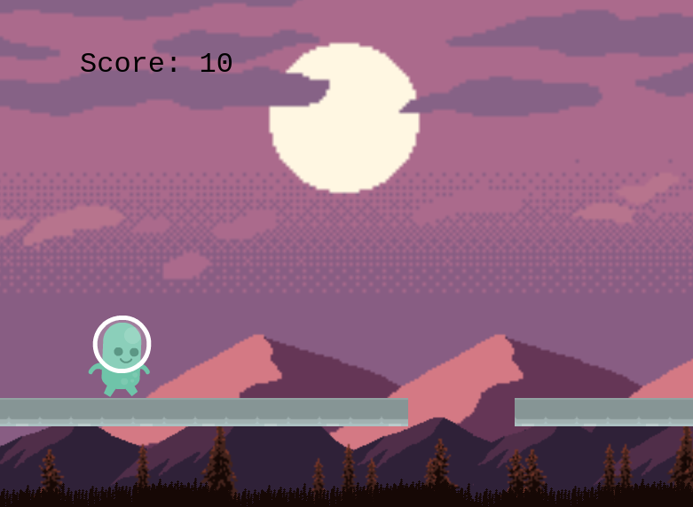

# Jumper-Man

> It's a 2d game with a cute boy who set himself out for an endless adventure to jump collect coins and avoid traps on speeding various platforms



## Built With

- HTML
- CSS
- Phaser
- JavaScript
- ES6
- Webpack
- Jest

## Live Demo

**If the game take too long to load OR stuck at 91% just press f5** <br>
[Live Demo Link](https://stoic-bhaskara-99dd55.netlify.app/)

## Game Design Document

This is a game based on an endless running journey and the hero is a cute alien boy with a mission to collect as many scores as possible to come as number 1 on the leaderboard.
He must avoid traps and falling or otherwise he meets his doom.
The cute boy can jump once, twice, and thrice in midst of air defying rules of physics and allowing him to avoid falling to infinity or falling on the Deathbringer spikes.
[Game Design Document (GDD) Link](./GDD.md)

### How to play

- JUMP:
  [ Space bar ]

### Prerequisites

- Live Server plugin for Visual Studio Code

### Setup

1- Clone the repository

```
    git clone https://github.com/AbdelrhmanAmin/Jumper-Man.git
```

2- Open the folder on VS Code.

```
    cd Jumper-Man
    code.
```

3- install Packages

```
    npm install

```

3- Run live server

```
    npm run server
```

4- Everything should be running by now.

### JavaScript Build

1- Run the next on your terminal in the repository folder

```
    npm start
```

### Testing

Run the next on your terminal in the repository folder:

```
    npm run test
```

## Author

😎 **Abdo Amin**

- GitHub: [@Abdelrhman-Amin](https://github.com/AbdelrhmanAmin)
- Twitter: [@Abdo Amin](https://twitter.com/AbdoAmi60489112)
- LinkedIn: [@Abdo Amin](https://www.linkedin.com/in/abdoamin/)

## Show your support

Give a ⭐️ if you like this project!

## Acknowledgments

- Credit (Kenney or www.kenney.nl)
- All respective designers and developers who gave me the chance to use their assets and packages
- [Microverse](https://www.microverse.org/).
